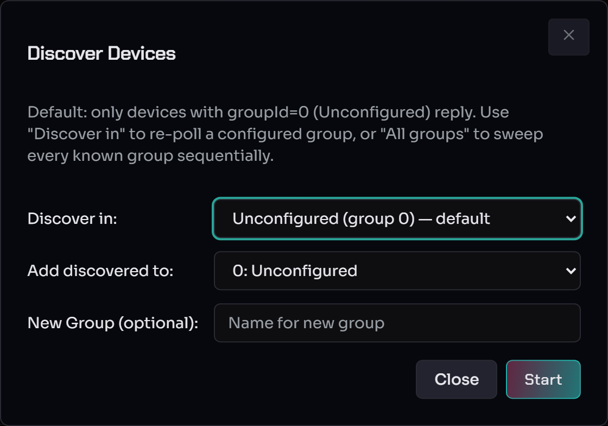
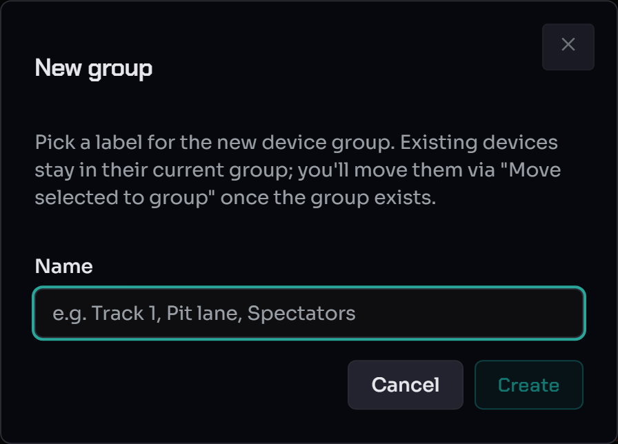
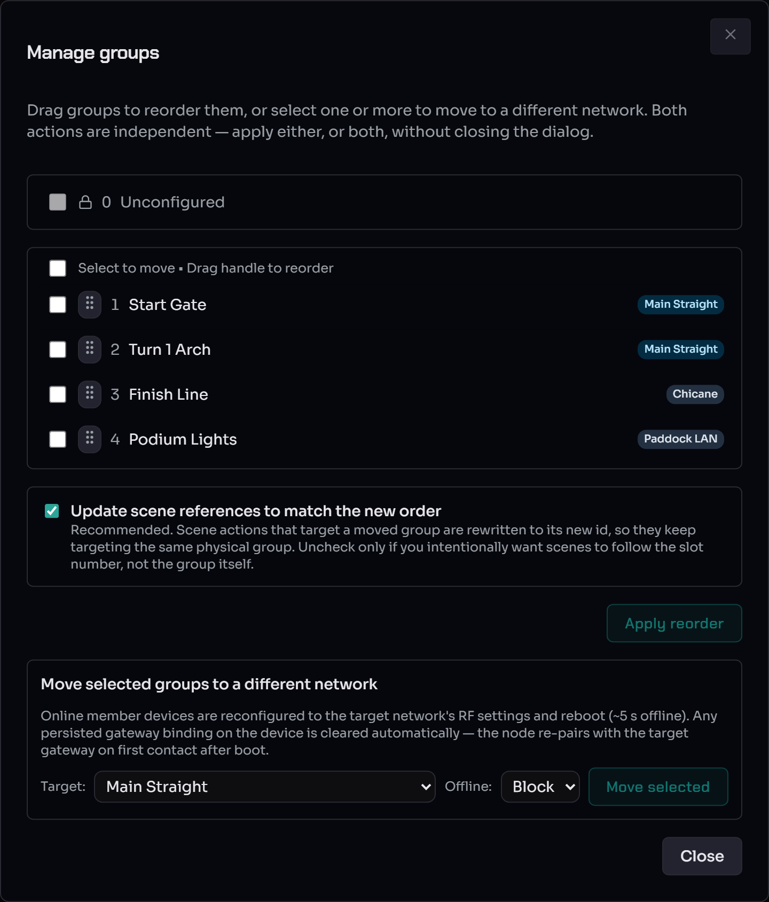
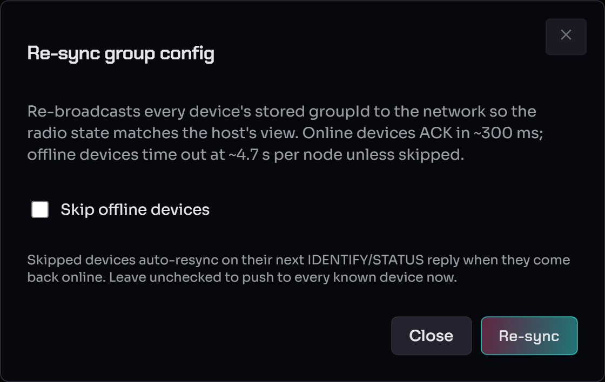
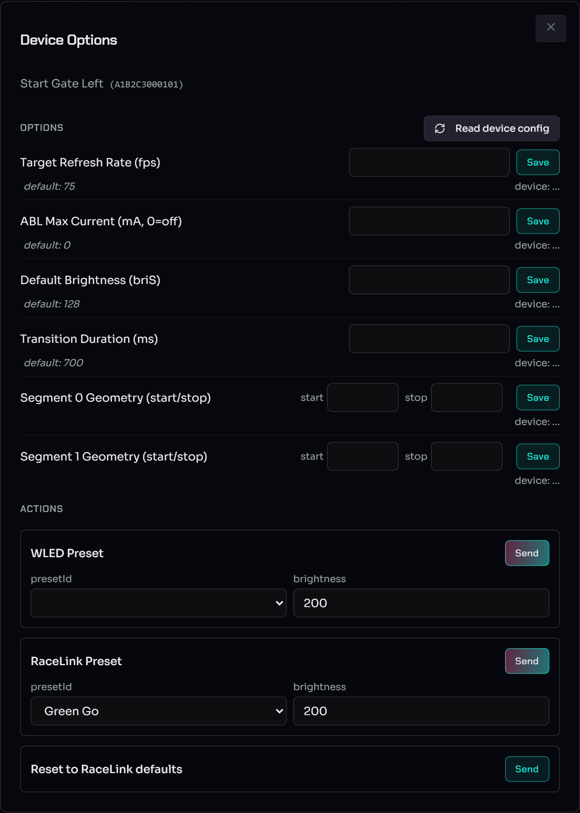

# Discover & configure devices

From "no devices yet" to a fleet that's grouped, configured, and ready
to drive. This is the first workflow after you've confirmed the
gateway badges are green on the [WebUI Overview](webui-overview.md).

> **Audience.** Operators setting up a deployment. For the on-screen
> map of every bar and badge, read the [WebUI
> Overview](webui-overview.md) first; for authoring effects afterwards
> see [RL Presets](rl-presets.md) and [Scene
> authoring](scene-authoring.md).

A few terms used throughout (full list in the [Glossary](../glossary.md)):

* **Device** — one piece of RaceLink hardware (a WLED node, a
  starting-block, …), identified by its MAC; the table shows the last
  6 hex for brevity.
* **Group** — a named bucket of devices, usually by physical location
  ("Pit Wall", "Start Line"). Most scene actions target a group. A group
  holds devices from **one network only**. A new or emptied group has
  **no network yet** and adopts the network of the **first device that
  joins it** — which also decides whether it is an RF or an Ethernet
  group. Remove the last device and the group reverts to unassigned.
* **Network** — the gateway + radio (RF) or the host's own NIC
  (Ethernet) that a group's devices live on. One network per group.

**Network badges.** Every device row and every assigned group shows a
small coloured **network badge** naming its network, with a kind icon —
a radio glyph for **RF**, a network glyph for **Ethernet** — so the two
kinds read at a glance. The badge appears in the device table, the
Groups sidebar, the **Manage groups** dialog, and the scene editor's
**Select target groups** picker. Static groups (`Unconfigured`,
`All WLED Nodes`) and empty/unassigned groups carry **no badge** — they
belong to no single network.

---

## Discover devices

Click **Discover** in the menu band.

* **Discover in** — which group to poll. The default,
  **Unconfigured (group 0)**, only reaches devices that aren't yet
  assigned — the right choice for a first run. Pick a configured group
  to re-poll it, or **All groups** to sweep every known group
  sequentially.
* **Add discovered to** — the group newly-found devices are assigned
  to (default `0: Unconfigured` — you'll move them later).
* **New Group (optional)** — name a group to create and drop the
  discovered devices straight into it.

Click **Start**. The host fires a broadcast and waits a few seconds for
replies; the master bar's task line shows progress. As
`IDENTIFY_REPLY` packets arrive the device table populates over SSE.
Closing the dialog does not cancel the sweep.

### "Discovered 0 devices"

* The devices are off, out of range, or paired to a different gateway.
  Check the gateway badge: if it cycles TX → RX → green, the host did
  transmit and open a window, but nothing replied.
* Each node pairs to one gateway by MAC at first boot. To un-pair a
  device that's bonded to a different gateway, use **Forget master
  MAC** in the [Node Config dropdown](#node-config-single-shot-commands),
  then re-discover. See [WLED master
  pairing](../RaceLink_WLED/master-pairing.md) for the full model.
* The device may be **stranded on another channel** — run a [Channel
  Scan](multi-network.md#channel-scan-stranded-device-recovery).

---

## Create groups and assign devices

Click the **+** in the Groups sidebar, name the group ("Pit Wall",
"Start Line", …), and **Create**. Existing devices stay where they
are — you move them in next.

### Bulk actions

Tick the devices you want in the table, then use the bulk-actions
toolbar that appears above it:

Pick the destination group from **Move selected to group** and click
**Move**. The confirmation shows the count and target for a sanity
check — it sends a `SET_GROUP` packet per device and waits for each
ACK. If a device is offline its ACK times out and that one
reassignment is recorded as failed; the others continue. **Rename…**
relabels the selected device.

> **Boundary rule.** A bulk move that would mix devices from different
> networks is rejected (HTTP 400). Moving into **Unconfigured**
> (group 0) is always allowed — it's the cross-network sink. See
> [Multi-Network §Boundary enforcement](multi-network.md#boundary-enforcement).

### Manage groups (reorder + move between networks)

The **↕ Manage groups** button beside **+** opens a dialog that
combines two independent actions — apply either or both without
closing it:

* **Reorder** — drag the handles to change group order. Leave **Update
  scene references to match the new order** ticked (the default) so
  scene actions follow the group by its new id; untick only if you
  want scenes to follow the slot number instead.
* **Move groups between networks** — tick one or more groups (their
  current network badge is shown on the right, if assigned), pick a
  **Target** network, and click **Move selected**. Static groups
  (`Unconfigured`, `All WLED Nodes`) are network-agnostic and can't be
  moved; an empty group shows no badge until a device joins it. Online
  member devices reconfigure to the target network and
  reboot (~5 s offline), then re-pair to the target gateway on their
  own. The full offline-handling (Block / Skip / Force) is in
  [Multi-Network §Move groups between networks](multi-network.md#move-groups-between-networks).

### Re-sync group config

After devices are in real groups, **Re-sync group config** in the menu
band re-broadcasts every device's stored group assignment to the
network — the recovery action when nodes were reflashed or moved and
their in-radio state drifted from the host's view.

Online devices ACK in ~300 ms; offline devices time out at ~4.7 s
each unless you tick **Skip offline devices** (skipped devices
auto-resync on their next identify/status reply when they come back
online). Leave it unchecked to push to every known device now.

### Devices that won't auto-pair — Pair Assistant

When pre-existing devices don't pair after a gateway change, open the
**Pair Assistant** (the wrench icon, the reconnect banner, or Host
Settings). It walks four recovery cases — re-pair on the current
settings, migrate devices from old to new settings, bring the gateway
to the devices' settings, or recover unknown settings. See
[Multi-Network §Setup-Change Assistant](multi-network.md#setup-change-assistant).

---

## Configure devices (Specials)

The **Specials** button in each device row opens the per-device
**Device Options** dialog.

Settings are grouped into per-capability sections. WLED nodes expose
LED properties (Target Refresh Rate, ABL Max Current, Default
Brightness `briS`, Transition Duration, Segment geometry);
starting-blocks show their slot layout; etc. Each row carries its
declared schema default as italic helper text.

### Live read on open + divergence resolution

When the dialog opens, the host issues one
[`OPC_GET_CONFIG`](../reference/wire-protocol.md#p_getconfig-read-back-request-opc_get_config-1-b-fixed)
per property and shows the device's live value under each row:

* `device: <value> ✓` — the live value matches the host's stored
  intent. Nothing to do.
* `device: <value> ⚠` — the device disagrees. Two compact buttons
  resolve it:
    * **Push host** — re-send the host's stored value, overwriting the
      device.
    * **Import device** — adopt the device's reported value into the
      host's database (no wire packet sent).
* `device: ?` plus **Retry** — the live read timed out (~1.5 s); Retry
  sends a fresh `OPC_GET_CONFIG`.

### Save — applies at runtime, no reboot

Edit a value and click **Save**. The host sends `OPC_CONFIG`, waits for
the device's ACK, and persists the value. **No follow-up read is
needed** — the ACK proves the device stored it. Every property change
applies immediately at runtime (FPS via `setTargetFps()`, ABL via
`setMilliampsMax()`, geometry via `setGeometry()`, transition via
`transitionDelayDefault`); the **Default Brightness (briS)** row also
snaps the live brightness. The `cfg.json` is written on the next
main-loop iteration so the change survives a reboot.

While the save is in flight (~500 ms) the row shows a small spinner;
once the host's database catches up it resolves to `device: <value> ✓`.
A genuine failure (ACK timeout, offline) surfaces a task-error toast.

### Properties vs Methods

The WLED section carries two kinds of entries (wire view:
[opcodes §"Properties vs Methods"](../reference/opcodes.md#properties-vs-methods)):

* **Properties** — persistent values with input fields and Save
  buttons (the rows above).
* **Methods** — one-shot actions:
    * **WLED Preset** — apply a numeric WLED-preset slot.
    * **RaceLink Preset** — apply a host-side [RL preset](rl-presets.md)
      by id.
    * **Reset to RaceLink defaults** — destructive maintenance action;
      clears every host-set override AND applies the RaceLink baseline
      at runtime (FPS 75, ABL 0, briS 128, transition 700 ms, segments
      collapsed to a single full-strip `seg[0]`). Confirm-gated; after
      success the dialog re-reads every property. All rows match the
      new defaults except the **segment rows** — the host can't know
      the strip length, so click **Import device** on each segment row
      to adopt the device's actual geometry.

---

## Node config — single-shot commands

The **Node Config** dropdown sends a single command to exactly one
selected device:

* **WLAN AP open / closed** — open or close the node's WLED access
  point.
* **Forget master MAC** — drop the device's bond with the current
  gateway. The next discovery re-pairs it to whichever gateway sent
  the broadcast — useful when migrating devices between gateways,
  confusing if clicked mid-race. See [WLED master
  pairing](../RaceLink_WLED/master-pairing.md).
* **Reboot node** — restart the device.

It refuses to act unless exactly one device is selected (the hint text
spells this out).

### Config display (column toggles)

The **Config display** toggles choose which device-config columns the
table renders (MAC filter, MAC filter persist, WLAN AP open, …) so you
can surface only the fields relevant to the task at hand.

---

## See also

* [WebUI Overview](webui-overview.md) — the on-screen map and the
  healthy-start checklist.
* [Firmware updates & WLED presets](firmware-updates.md) — OTA flow
  and the WLED Presets uploader.
* [RL Presets](rl-presets.md) / [Scene authoring](scene-authoring.md) —
  authoring the effects you fire on these devices.
* [Multi-Network operator guide](multi-network.md) — networks, Channel
  Scan, Pair Assistant, moving groups between networks.
* [Troubleshooting](../troubleshooting.md) — discovery / bulk-set /
  pairing failure modes.
