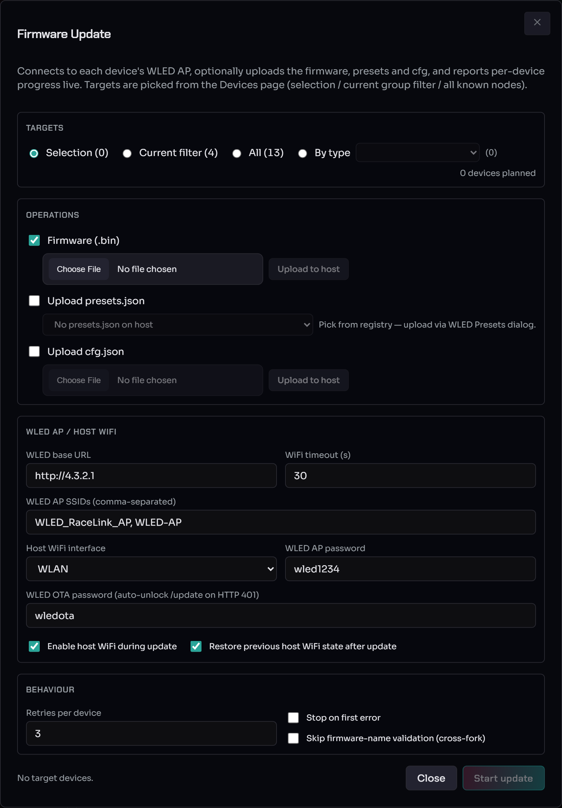
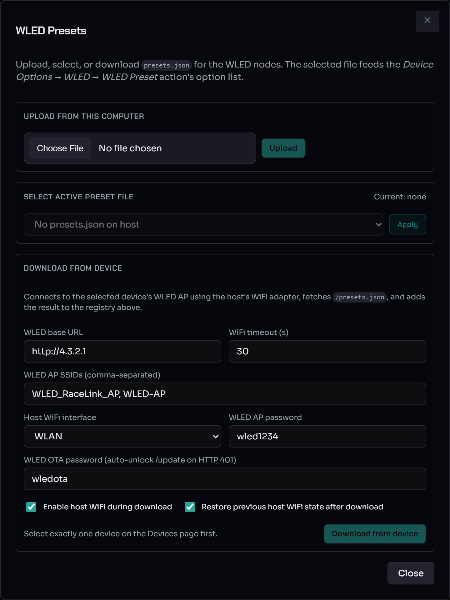

# Firmware updates & WLED presets

Flashing WLED firmware over the air (OTA) and pushing `presets.json`
to your nodes — both use the same per-device WiFi flip-flop under the
hood, so they share a dialog layout and the same failure modes.

> **Audience.** Operators updating node firmware or WLED preset slots.
> For the OTA gate matrix (developer view) see [WLED OTA gate
> matrix](../reference/wled-ota-gates.md).

---

## Firmware Update (OTA)

Open the **Firmware Update** dialog (Devices page). It connects to each
target device's WLED AP, optionally uploads firmware / presets / cfg,
and reports per-device progress live.

Top to bottom:

* **Targets** — *Selection*, *Current filter*, *All*, or *By type*.
  The planned-device count is shown on the right.
* **Operations** — tick **Firmware (.bin)** and choose the binary;
  optionally **Upload presets.json** and **Upload cfg.json**.
* **WLED AP / Host WiFi** — the WLED base URL, WiFi timeout, the AP
  SSIDs to scan for (default `WLED_RaceLink_AP, WLED-AP`), the host
  WiFi interface, AP password (default `wled1234`), and the **WLED OTA
  password** (default `wledota`, auto-unlocks on HTTP 401). **Enable
  host WiFi during update** and **Restore previous host WiFi state
  after update** default on.
* **Behaviour** — **Retries per device**, **Stop on first error**, and
  **Skip firmware-name validation (cross-fork)**.

### Plan ~30 seconds per device

A 10-board fleet finishes in ~5 min, a 4-board fleet in ~2 min. The
dialog shows this estimate next to **Start update**; during the run a
live `elapsed · ~remaining left` counter self-refines from observed
times once one device has completed, then counts down monotonically.
The estimate scales linearly — larger fleets don't slow each device
down.

Per device, the host:

1. Sends `OPC_CONFIG` to enable the device's WLED AP and waits for the
   ACK (1.5 s with one automatic retry). If both attempts time out the
   device is marked failed and the workflow moves on within ~3 s.
2. Scans for the AP SSIDs and connects with the AP password, locking
   the connect to the device's predicted AP-BSSID (ESP32 default
   `STA_MAC + 1`) so it can't grab a previously-flashed node still in
   the scan cache.
3. Verifies the node's MAC via `/json/info`.
4. Uploads the firmware binary.
5. (Optional) uploads `presets.json` and/or `cfg.json`.
6. Disconnects host WiFi from the rebooting device.
7. Waits for the device to re-announce on the RaceLink radio, then for
   the auto-restore path to push its old group ID back.
8. **AP-close cleanup is conditional** — on a clean upload the WLED
   reboot drops the AP automatically. The AP-disable `OPC_CONFIG` only
   fires when AP-enable succeeded *but* a later step failed (so the AP
   is still broadcasting and would expose the WLED AP credentials).

#### Where the time goes (per device, typical)

| Phase | Duration |
|---|---|
| RaceLink AP-enable round-trip | ~0.3 s (up to 3 s on retry+fail) |
| Wait for AP to appear in scan | ~5 s |
| `nmcli` connect (auth + DHCP) | ~2 s (up to ~10 s on channel contention) |
| Firmware HTTP `/update` (1.1 MB binary) | ~10 s |
| Post-upload host-WiFi disconnect | ~0.1 s |
| Device reboot → `IDENTIFY_REPLY` | ~2 s |
| Auto-restore `SET_GROUP` ACK | ~0.5 s |
| AP-close ACK (only on the error-after-AP-open path) | ~0.3 s (up to 3 s) |
| **Per-device subtotal (success path)** | **~20 s** |

No NetworkManager profile pre-creation is needed — the host talks to
`nmcli` directly. On a fresh Linux machine the one-time polkit grant
(`sudo $(which racelink-setup-nmcli)`, then restart the host) is in
[standalone-install.md §"Linux first-time setup"](standalone-install.md#linux-first-time-setup-for-firmware-updates).

### During the run

**Don't close the dialog or refresh the page.** That doesn't cancel
the work (the task runs in a host-side thread) but you lose the
per-device progress display until it finishes. A failed device shows
red **with the concrete failure message inline** (e.g. `Timeout
waiting for CONFIG ACK from <MAC> (AP-enable)`), so you don't wait for
the summary to find out why. The other devices continue unless **Stop
on first error** is ticked. After the run, re-trigger just a failed
device by selecting it and starting a new update. The summary shows a
**Total time: M:SS** badge alongside success / failed / skipped counts.

### Common OTA failure modes

* **`HTTP 401 from /update`** — WLED rejected the POST. Two gates:
    * **Same-network gate** (usual in mixed AP+STA fleets). The host
      POSTs `/settings/sec` on 401 to flip `otaSameSubnet=false` and
      clear the lock; the retry then succeeds and the change persists
      in the device's `cfg.json`.
    * **OTA lock with a non-default password** — override the WLED OTA
      password field (default `wledota`).
* **`AP '<SSID>': authentication failed`** — wrong WiFi PSK, or the
  device's hostapd is rate-limiting after recent failures. Wait ~30 s
  and retry once before assuming a config mistake.
* **`PIN code required`** — the device has `settingsPIN` set in WLED
  Security. Clear the PIN; the host doesn't auto-enter it.
* **`HTTP 500 … Firmware release name mismatch`** — WLED rejected the
  binary because its `WLED_RELEASE_NAME` differs from the running
  firmware's (common when migrating between forks). Tick **Skip
  firmware-name validation** and retry. Leave it unchecked once the
  fleet is on consistent firmware — flashing the wrong binary for the
  chip variant can brick a device.

> **What does NOT help:** changing the host's IP or netmask. The
> same-network gate uses *the device's* `Network.localIP()`, not the
> host's. The host-side auto-unlock is the only way to clear that gate
> without reconfiguring each device by hand. See the full four-gate
> breakdown in [WLED OTA gate matrix](../reference/wled-ota-gates.md).

---

## WLED Presets

The **WLED Presets** dialog (Devices-page menu band) uploads or
downloads a `presets.json` — the file that backs the *Device Options →
WLED → WLED Preset* slot list.

* **Upload from this computer** — pick a `presets.json` and **Upload**
  it to the host's registry (validated as JSON first).
* **Select active preset file** — choose which uploaded file is active
  and **Apply** it.
* **Download from device** — connects to one selected device's WLED AP
  (same WiFi fields as the OTA dialog), fetches its `presets.json`, and
  adds it to the registry. Select exactly one device on the Devices
  page first.

Pushing presets to many devices reuses the OTA path: the host connects
to each device's AP, POSTs `presets.json`, and disconnects. The task
runs through the task manager — closing the dialog doesn't cancel the
upload. Each target's WLED preset slots (1, 2, 3, …) are overwritten,
so scenes that apply a WLED preset by index resolve to those slot
definitions on the device.

> **RL Presets vs WLED Presets.** RL presets are RaceLink-native,
> referenced by name from scene actions, and edited in the [RL Presets
> dialog](rl-presets.md). WLED presets are WLED's own per-device slots,
> addressed by index, and managed here. Both terms are defined in the
> [Glossary §"Preset"](../glossary.md#preset).

---

## Safety reminders

* **Don't unplug the gateway USB while a scene or OTA is running.** The
  host detects the disconnect within ~50 ms; the badge goes red with
  `LINK_LOST` and auto-retries on reconnect.
* **Don't share the gateway between processes.** Only one process can
  own the USB-LoRa dongle (`exclusive=True`); a second one fails with
  `PORT_BUSY`.

---

## See also

* [WebUI Overview](webui-overview.md) — the on-screen map.
* [Discover & configure devices](device-setup.md) — get devices on the
  wire before flashing them.
* [WLED OTA gate matrix](../reference/wled-ota-gates.md) — the
  developer-side gate breakdown.
* [standalone-install.md](standalone-install.md#linux-first-time-setup-for-firmware-updates) —
  Linux `nmcli` polkit setup for OTA.
* [Troubleshooting](../troubleshooting.md).
