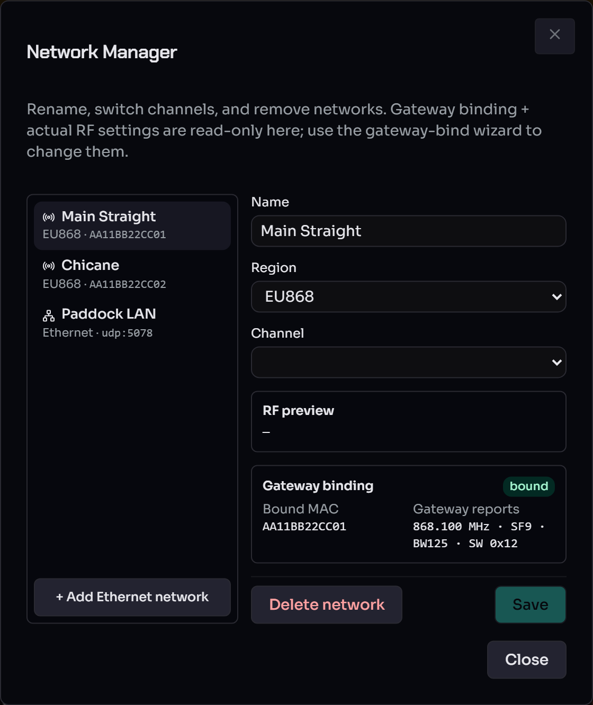
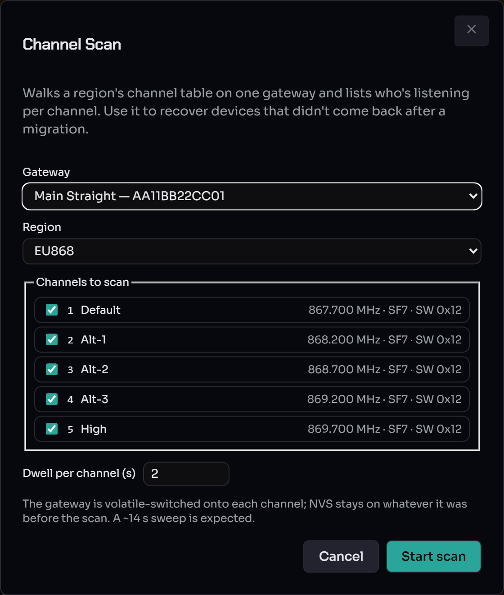
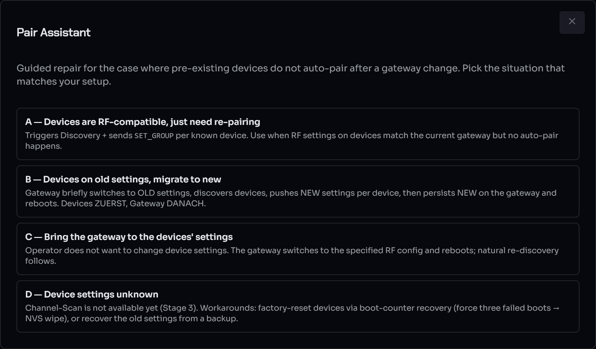

# Multi-Network operator guide

Connect more than one RaceLink gateway to the same host, drive each
on its own LoRa channel, and keep their device sets cleanly
separated. This guide walks the flows an operator interacts with:
creating a network, the bind wizard, RF migration after a channel
change, the per-network reconnect banner, and Channel Scan to
recover stranded devices.

For the underlying wire formats, see
[`reference/wire-protocol.md`](../reference/wire-protocol.md) §
`P_RfConfig` and §`OPC_RF_CONFIG`. For the channel table itself,
see [`reference/channels.md`](../reference/channels.md).

!!! note "Networks also come in an Ethernet kind (draft)"
    This guide covers **RF** networks (a LoRa channel bound to a
    gateway). A network can instead be of *kind* **Ethernet** — an
    IP/LAN network where the host interface is the transport, reaching
    devices over UDP. See [Ethernet networks](ethernet-networks.md)
    (draft proof-of-concept).

## When you'd reach for this

A second gateway buys you two things, both of them direct
consequences of running a second LoRa radio in parallel:

* **More bandwidth.** Each gateway transmits independently on
  its own channel, so two gateways roughly double the airtime
  budget for fleet-wide operations. A scene that broadcasts to
  both halves of the deployment runs in the airtime of one
  radio, not the sum.
* **Parallel communication with different parts of the setup.**
  The host can drive one part of the deployment at the same
  time as another, rather than serialising every packet through
  a single channel.

The rest of this guide walks the operational flows that come
with running more than one gateway: creating networks, the bind
wizard, RF migration after a channel change, hardware-swap
recovery, the per-network reconnect banner, and Channel Scan
for stranded devices.

## Concept refresher

* A **Network** (`RL_Network`) is the operator-visible bundle of
  a name, a `gateway_mac` binding, and an `rf_config`. Devices
  belong to exactly one network at a time. The
  host's v1→v2 migration creates a default network on first
  boot so single-gateway deployments inherit the multi-network
  data model transparently.
* A **Group's network is decided by its members**, not set up
  front. A group holds devices from **exactly one** network (the
  boundary validator refuses to mix networks in a group). A new or
  emptied group is **network-agnostic** — it has no network and shows
  no [network badge](#network-badges); the first device that joins
  stamps the group's network, and therefore whether it is an **RF** or
  an **Ethernet** group. Remove the last device and the group reverts to
  unassigned, free to be re-purposed for either kind. (`Unconfigured`
  and the static `All WLED Nodes` group are permanently agnostic.)
* A **Channel** is a named slot in the host's region table
  (max five per region — see
  [`reference/channels.md`](../reference/channels.md)). Picking
  a channel for a network resolves to the seven wire-format
  `P_RfConfig` fields.
* **Bind state** per attached gateway: `pending`, `bound`,
  `conflict`, or `unbound`. The bind state machine inspects
  every gateway as it attaches. The bind wizard auto-opens
  for `conflict` / `unbound` only — the broader
  SetupChangeAssistant is operator-triggered (see
  [Reconnect banner](#per-network-reconnect-banner) below).
* **RF state** per attached gateway: `IDLE`, `TX`, `RX_WINDOW`,
  `RX`, `ERROR`, or `UNKNOWN`. Mirrored from the gateway's
  spontaneous `EV_STATE_CHANGED` events. The per-gateway pill
  in the header colour-codes Bind + RF state together (see
  [Per-gateway pills](#per-gateway-pills) below).

## Day-to-day: the Devices page with two gateways

After a successful boot with two gateways attached:

* The **Network filter dropdown** appears above the Groups
  sidebar — only visible at N>1, so single-gateway deployments
  see no UX change. "All Networks" is the default.
* The **Device Table** gains a "Network" column with a
  coloured badge per row (deterministic palette by network id;
  a given network keeps the same colour across reloads).
* **Hover the badge** for the device's last-known `freq_hz` /
  SF / BW / SyncWord — a quick read of "is this node where the
  network expects it to be".
* **Group filter** still works the same; combined with the
  network filter, the table shows the intersection.

## Network badges

A **network badge** is a small coloured chip naming a network, with a
**kind icon** — a radio glyph for **RF**, a network glyph for
**Ethernet** — so the two [network kinds](ethernet-networks.md) are
distinguishable at a glance. The colour is a deterministic palette pick
by network id, so a given network keeps the same colour across reloads.

The badge appears wherever a device or group's network is shown:

* the **Device Table** "Network" column (hover for the device's
  last-known `freq_hz` / SF / BW / SyncWord on RF rows);
* the **Groups sidebar** rows;
* the **Manage groups** dialog;
* the scene editor's **Select target groups** picker.

Static groups (`Unconfigured`, `All WLED Nodes`) and empty / unassigned
groups carry **no badge** — they belong to no single network (see the
group-network rule in the [concept refresher](#concept-refresher)).

## The Network Manager dialog

The Network Manager covers CRUD on existing networks — rename, switch
channels, and remove. It is opened from the master bar.



The left pane lists every network with its kind and binding (RF
networks show `<region> · <gateway MAC>`; Ethernet networks show
`Ethernet · udp:<port>`), plus an **+ Add Ethernet network** button.
The right pane edits the selected network's **Name**, **Region** and
**Channel**, with a live **RF preview**. The **Gateway binding** panel
(bound MAC + the settings the gateway actually reports) is **read-only
here** — change the binding or actual RF settings via the gateway-bind
wizard, not this dialog. **Save** persists name/channel edits (a
channel change that diverges from what the gateway is broadcasting
prompts an [RF migration](#rf-migration)); **Delete network** removes
the selected one.

## Create a network

The flow for creating a fresh network starts from the
**GatewayBindWizard** when an unknown gateway attaches:

1. Plug a previously-unknown gateway into the host's USB port.
2. The wizard auto-opens with state `unbound` once the gateway's
   identity reaches the host (~1–2 s after plug). It shows the
   `ident_mac` and the RF settings the gateway is broadcasting
   on.
3. Pick **"Create a new network for this gateway"**. The form
   inline:
     * **Name** — free-text label ("Pit-Lane", "Default", …).
     * **Region** — `EU868` / `US915` / whatever the host's
       channel table carries.
4. The network is created with `rf_config` seeded from the
   gateway's reported settings, the transport is bound to it,
   and the SSE `gateway_bound` event closes the dialog.

The other unbound-flow option, **"Bind to an existing
network"**, is the hardware-swap path — pick an existing
network and the new ident_mac takes over its binding. If the
existing network's persisted `rf_config` disagrees with the
new gateway's NVS, the bind wizard immediately re-opens in
**`conflict`** mode so you can resolve.

## Conflict resolution

State `conflict` means: the gateway is bound to a known
network, but its NVS RF settings disagree with what the
network expects. The wizard renders a per-field diff
("Host expects" vs "Gateway reports") and asks for one of:

* **Accept the gateway's settings.** Updates the network
  record to match the gateway. No migration, no device
  reboots. Use this when you flashed or re-tuned the gateway
  intentionally.
* **Push the host's settings (migrate).** Runs the four-phase
  RF migration: push `OPC_RF_CONFIG` to every device, then
  persist-switch the gateway, then verify via discovery. See
  [Migration](#rf-migration) below.

The wizard stays open while a migration is in flight (the
state stays at `conflict` with `migration_pending=true` until
the engine flips it back to `bound`).

## RF migration

Three operator paths trigger an RF migration; they all run the
same four-phase TaskManager job:

* **Bind wizard → "Push the host's settings"** when the gateway
  comes back in a `conflict` state. The wizard stays open and
  switches to a `migrating` step that subscribes to the task's
  live phase / index / total / current MAC and shows a progress
  bar. When the task completes, the wizard flips to `done` (or
  `error`) with a Close button.
* **NetworkManagerDialog → edit channel → Save.** If the new RF
  config differs from what the gateway is actually broadcasting
  (`gateways.get(mac).rf_config_actual`), a confirmation prompt
  asks whether to push to the gateway. Choosing **Migrate**
  kicks the same TaskManager job; progress shows in the master
  bar's task line.
* **NetworkManagerDialog → "Custom RF" → Save.** Same flow as
  the channel edit, just with raw P_RfConfig values from the
  channel-table's "unchanged" option.

A single migration job at a time — the host returns `409 busy`
if another long-running task (firmware update, channel scan)
is already in flight.

The four phases:

1. **Pre-check** — list every device on the network. Skip
   those already on the target config (their
   `last_known_rf_config` matches). Optionally skip offline
   devices; the operator can override that from the wizard.
2. **Phase 1 — Device push.** For each remaining device the
   host sends `OPC_RF_CONFIG(target)` via the current
   (old-config) gateway. Each device validates, persists to
   NVS, ACKs, then reboots ~50 ms later onto the new settings.
   They become invisible to the current gateway — expected.
3. **Phase 2 — Gateway switch.** After every device push
   completes (or the operator overrides on a partial), the
   host sends `GW_CMD_SET_RF_CONFIG(target, persist=true)`.
   The gateway writes NVS + reboots onto the new settings.
   The host's reconnect machinery re-opens the USB device
   automatically.
4. **Phase 3 — Verification.** Post-reboot discovery on the
   new channel. Devices that respond have their
   `last_known_rf_config` updated. Devices that don't are
   marked **stranded** — see Channel Scan below.

A successful migration flips the bind state back to `bound`
on the SSE channel; the wizard closes itself.

## Channel Scan (stranded-device recovery)

Open with the 🔎 magnifier button in the header (or via the
SetupChangeAssistant's per-row "Run channel scan" action).



1. Pick the gateway to scan from (single-gateway deployments
   default to the only one).
2. Pick the region. Defaults from the chosen gateway's network.
3. Tick the channels to walk; defaults to every channel in
   the region.
4. Set the per-channel dwell. The default 2 s catches the
   discovery-default reply window with margin.
5. Hit **Start scan**. The gateway volatile-switches onto each
   channel (no NVS write), broadcasts `OPC_DEVICES`, dwells,
   then moves on. After every channel the gateway is restored
   to its pre-scan settings via another volatile switch.

The result panel shows a per-channel table:

* **Known** devices: name + MAC + which network they
  currently belong to. Their `last_known_rf_config` is updated
  in-place so a follow-up migration can skip them.
* **Unknown** devices: MAC only, tagged amber. These are nodes
  the host's repo doesn't know about; you'd typically run the
  discovery dialog with the scanned channel as the active one,
  or migrate them in via a temporary network.

The scan is read-only at the device level — it doesn't push
any settings, only observes. Stranded devices stay on their
own NVS-persisted channels until you explicitly migrate them.

## Per-gateway pills

The header's master bar carries one pill per attached gateway
instead of the pre-multi-network single master pill. Each pill
combines the two state machines via colour:

| Bind state | RF state (when `bound`) | Colour | Meaning |
|---|---|---|---|
| `bound` | `IDLE` | green | Ready for next send. |
| `bound` | `TX` | blue | Transmitting on the LoRa wire. |
| `bound` | `RX` / `RX_WINDOW` | warm yellow | RX window open waiting for a node reply. |
| `bound` | `ERROR` | red | Gateway reported a fault. |
| `bound` | `UNKNOWN` | grey | No spontaneous state event yet — click ↻ to query. |
| `conflict` | — | amber border | Bind wizard wanted: RF config disagrees with the network. |
| `unbound` | — | red border | No matching network — operator must create or rebind. |
| `pending` | — | grey | Mid-handshake, or last GET_RF_CONFIG didn't reply. |

The label inside each pill is the network name (`Pit-Lane`,
`Default`, …) plus the last 4 hex of the gateway's `ident_mac`
to disambiguate two gateways on the same network. Hover reveals
the full ident_mac, bind state, RF state and any conflict
fields.

The **↻** button next to the pills fans a `GW_CMD_STATE_REQUEST`
out to every attached gateway in parallel and refreshes every
pill in one round-trip. Used right after a reconnect when a
pill is still grey but you want confirmation it's actually
back on the wire.

A `⚠ Pair…` button appears in the header whenever any
gateway is in `conflict` or `unbound` — clicking it re-opens
the bind wizard for the affected gateway without needing a
USB reconnect.

## Per-network reconnect banner

When a gateway disappears mid-session (USB cable yanked,
adapter glitch, intentional unplug), only that one transport
drops out — sibling gateways stay fully online and keep their
device traffic flowing.

What the operator sees:

1. The disappearing gateway's per-gateway pill vanishes from
   the master bar.
2. A red **reconnect banner** appears below the header listing
   every persisted network whose `gateway_mac` is not currently
   attached, with a per-row live countdown:

       ⚠ Pit-Lane (9C:13:9E:9E:1C:10) — retry in 4s     [Cancel]
       ⚠ Default  (48:CA:43:3C:D4:E0) — retry in 2s     [Cancel]

       [Open Pair Assistant]   [Cancel all]

3. The host's background **reconnect tracker** polls every 5s
   for the missing MACs. The probe enumerates only ports that
   are NOT currently in use, so no healthy transport is ever
   disturbed.
4. As soon as the operator plugs the gateway back in, the next
   poll tick discovers it, attaches it, sends a state-request
   to seed the pill colour, and removes the row from the banner.

**Cancel** drops a single MAC out of the tracker until the
operator opts back in. Useful for an intentionally-retired
gateway you don't want to keep seeing in the banner — the
network row stays in the database, just isn't being polled
for. The `Open Pair Assistant` button reaches the broader
diff view (see below).

**Reconnect on host restart.** When the host process itself
restarts, both gateways attach during the normal `discoverPort`
boot path; the tracker only fires if a persisted network has
no matching transport after that boot.

## Setup-Change Assistant

The assistant catalogues every operator-actionable diff across
the networks + gateways + devices repos. It used to auto-open
once per session — that was disabled to stop dialog-spam during
USB flicker. The assistant is now reached via:

* The reconnect-banner's **Open Pair Assistant** button (covers
  the missing-transport case),
* The header's `⚠ Pair…` button (covers `conflict` / `unbound`),
* The host-settings menu (operator-driven inspection at any time).

The **Pair Assistant** front-end of the assistant walks the four
device-recovery cases when pre-existing devices don't auto-pair after a
gateway change — pick the situation that matches your setup:



* **A — Devices are RF-compatible, just need re-pairing.** The devices
  already share the gateway's radio settings; runs a discovery +
  group-assignment sweep that re-binds every known device. No radio
  settings entered.
* **B — Devices on old settings, migrate to new.** The gateway briefly
  switches to the *old* settings, discovers the devices, pushes the
  *new* settings per device, then persists the new settings on the
  gateway. You pick both as a **Region + Channel** from the channel
  table (see [Region & Channels](../reference/channels.md)).
* **C — Bring the gateway to the devices' settings.** The gateway adopts
  the devices' radio settings and reboots; natural re-discovery follows.
  Pick the device-side **Region + Channel**.
* **D — Device settings unknown.** Recovery hints only — recover the old
  settings from a backup and use case B, or factory-reset the affected
  devices via the boot-counter recovery path.

For B and C the dialog pre-selects the channel matching the gateway's
current settings, so the common "align to what the gateway already has"
case is one click.

Surfaced diff categories:

* **Gateway not attached** — a configured network's
  `gateway_mac` isn't currently visible on USB. The reconnect
  tracker is already polling for it; the assistant offers
  per-MAC cancel + a global "Re-discover now" trigger that
  forces an immediate enumeration (useful when you've just
  plugged the cable in and don't want to wait for the next
  5s tick).
* **Unknown gateway** — an attached gateway whose ident_mac
  doesn't match any network. Open the bind wizard.
* **RF mismatch** — bind state is `conflict`. Open the bind
  wizard.
* **Devices on stale RF** — at least one device's
  `last_known_rf_config` disagrees with the bound network's.
  Run a Channel Scan or trigger a migration to bring them in
  line.

Each row has a one-click follow-up button that hands off to
the right wizard.

## Boundary enforcement

A scene action or bulk regroup that would mix devices from
different networks is **rejected by the host** with HTTP 400:

* The **MultiGroupPickerDialog** in the scene editor anchors
  on the first selected group's network; groups on other
  networks get a disabled checkbox + an "other net" pill.
* The **bulk regroup** endpoint
  (`POST /api/devices/update-meta` with a `groupId`) runs the
  same validator server-side before the TaskManager job
  kicks off — the WebUI shows the structured error in a
  toast.
* Moving devices into the **Unconfigured** group (id 0) is
  always allowed; it's the cross-network sink.
* Moving a device into an **empty (network-agnostic) group** is
  also always allowed — there is no network to conflict with yet;
  the move stamps the group's network (and kind) from that first
  device. This is how an Ethernet device reaches a group: create a
  fresh group and drop it in.

The validator lives in
`RaceLink_Host/racelink/domain/network_boundary.py`. Two
boundary violations it detects:

* `devices_span_multiple_networks` — the operator selected
  devices that don't share a network. Move them one network at
  a time.
* `group_network_mismatch` — the devices agree on a network,
  but the target group is somewhere else. Migrate the devices
  to the target network first, then re-run the regroup.

## Scene broadcast scope

A scene's broadcast actions (`sync`, plus PRESET / CONTROL /
OFFSET with `target.kind == "broadcast"`) need to know **which
networks** to reach. Each scene carries a `network_scope` field
with two modes:

### Auto mode (default)

The host derives the scope from the scene's action targets at
runtime. Every non-sync action contributes its target's resolved
network(s) to a union:

| Action target | Contributes |
|---|---|
| `groups: [1, 2]` (each group on net-A) | net-A |
| `device: AABBCC112233` (on net-B) | net-B |
| `broadcast` (group 255) | every persisted network |
| `sync` / `delay` (no target) | nothing |

The union becomes the scene-wide broadcast scope. Sub-actions
inside `offset_group` containers descend recursively.

**Operator-visible consequence:** a scene that only touches
net-A no longer sends sync ticks to net-B's gateway — uninvolved
networks can't accidentally fire pre-loaded `arm_on_sync` effects.

### Explicit mode

The operator pins a specific set of network ids via the **Scope**
chip in the scene editor header (a dialog with an Auto/Explicit
radio + multi-select checkbox of networks). When explicit:

* The scene's runtime scope is the persisted list, soft-filtered
  against currently-attached networks (deleted networks drop out).
* The per-action target pickers in the editor restrict their
  group/device dropdowns to in-scope networks only. Out-of-scope
  choices are hidden.
* The `MultiGroupPickerDialog` keeps its single-network anchor
  rule per action but the visible groups are pre-filtered by
  the scene-wide scope first.
* Save-time validation rejects an action that targets a network
  outside the scope with `HTTP 400 {code: "scope_violation",
  offending_action_index: N}` — the editor highlights the
  offending row.

### Persisted shape

```json
"network_scope": {"mode": "auto"}
"network_scope": {"mode": "explicit", "network_ids": ["net-a", "net-b"]}
```

Scenes saved before this feature (no `network_scope` field) load
as `{"mode": "auto"}` — no migration required.

### Degradation rules (operator-visible)

| Condition | Outcome |
|---|---|
| Auto-mode, sync-only scene (no resolvable scope) | Falls back to "every attached gateway" with a deprecation log |
| Explicit-mode, one of the listed networks is deleted | The id is silently dropped from the runtime scope; sidebar shows an amber dot until the operator reconciles |
| Explicit-mode, every listed network is deleted | Scope resolves empty; broadcasts are NOT fanned out (no silent widening back to "all attached"). Run records `error="scope_resolved_empty"` and marks the action degraded |
| Explicit-mode + action target outside scope at save | Rejected with HTTP 400 — operator must fix the action or widen the scope before saving |

### Limits today

* **No per-action override** — a scene can't say "this particular
  sync fires only on network B even though the scene targets
  A+B". The scene-wide scope governs every broadcast in the scene.
* **No manual SYNC button** — broadcasts are scene-driven; the
  operator triggers them by running a scene.
* **No cost estimator multiplier** — the LoRa airtime estimate
  reflects single-network cost. A separate "Fan-out: N gateways"
  pill in the editor surfaces when a scene reaches 2+ networks
  (each gateway transmits in parallel, so wall-clock airtime is
  bounded by the slowest single-radio, not summed).

For deeper background see
[`architecture.md` §"Cross-network fan-out"](architecture.md#cross-network-fan-out-stage-3-part-g--broadcasttarget-refactor).

## Move groups between networks

A group ends up on the wrong network — either by an initial
mis-bind or because the operator wants to reorganise which group
belongs to which network. Since network membership lives at the
group level
(one network per group), the move is always group-granular: every
member device follows its group. The WebUI exposes a single entry
point — the sidebar's **Manage groups** dialog — which combines
drag-reorder with multi-group network migration in one panel.

### Where to start a move

Open the **Manage groups** dialog from the sidebar toolbar (the ↕
button next to **+** above the groups list). The dialog lists every
group with its current network badge on the right and a checkbox on
the left. Tick one or more rows, pick a **Target** network, click
**Move N selected**.

Static groups (`Unconfigured`, group `0`, plus `All WLED Nodes`) are
network-agnostic by design — their checkbox is disabled. An **empty
group** is likewise network-agnostic (no badge); rather than moving it,
just drop a device in and the group adopts that device's network (and
kind) automatically.

The move uses one RF migration path under the hood — push
`OPC_RF_CONFIG` with the target network's settings, then flip the
member's persisted `network_id` plus the group's own `network_id`
atomically.

### Offline behaviour modes

Default **Move** uses `offline_mode=block`: if any member device in
the move set is offline the server refuses with HTTP 400 and the
dialog reveals two fallback buttons:

* **Skip offline** — migrate the online devices' RF config + flip
  metadata. Offline devices have their `network_id` flipped in
  memory + persistence only; the wire push is skipped entirely.
  Channel Scan recovers the physical device when it comes back into
  range. This is the same offline-handling shape the existing
  group-move (devices/update-meta) uses.
* **Force offline** — try the wire push for offline devices too.
  Likely to time out (the device isn't actually reachable), but the
  metadata still flips. Same end-state as Skip for the offline
  devices, just with extra wall-clock spent waiting for ACKs.

The metadata flip happens regardless of wire outcome — operator
intent is "this group now belongs to network B", and the runtime
soft-filter (`scene_network_ids`) plus Channel Scan recovery handle
the physical reconciliation cleanly.

### Group flip atomicity

`group.network_id` flips together with every member's
`device.network_id`. If a member fails the wire push (offline /
time-out), the group still flips — the operator's intent governs.
The failed member's metadata also flips (it now reads "network B")
so the WebUI doesn't show a stale cross-network membership. Channel
Scan recovers the physical device.

The same atomicity holds across a multi-group move: if you tick
three groups and only one member device fails to reach the wire,
all three groups still flip — the failed device lands in the
stranded list with its now-known-good `last_known_rf_config`, ready
for Channel-Scan recovery.

### What happens to scenes that referenced the moved devices

* **Auto-scope scenes**: re-resolve on next run via
  `scene_network_ids` — the new network shows up automatically in
  the scope.
* **Explicit-scope scenes**: if the scene's explicit `network_scope`
  no longer covers the target network, the moved device's
  group/device action becomes "out of scope" — the editor shows
  the warning chip and the server rejects re-save.

For the wire-level details + service-layer trace see
[`architecture.md` §"Per-group network migration"](architecture.md#per-group-network-migration).

## Single-gateway operators

If you only have one gateway attached, the Stage-2/3 multi-network
groundwork is transparent:

* The default network created by the v1→v2 migration absorbs
  every device and group automatically; the badge in the
  Device Table reads "Default".
* The Network filter dropdown stays hidden (the sidebar
  doesn't render it at N=1).
* The bind wizard auto-pops on first attach (state `unbound`
  if there's no `gateway_mac` yet; otherwise immediately
  `bound`). The Stage-2 single-transport + unbound-network
  auto-bind handles this silently — you may never see the
  wizard.

## See also

* [`reference/channels.md`](../reference/channels.md) — the
  shipped region/channel table.
* [`reference/wire-protocol.md`](../reference/wire-protocol.md)
  §`P_RfConfig`, §`OPC_RF_CONFIG`, §`EV_RF_CHANGED`,
  §`GW_CMD_*_RF_CONFIG`.
* [`RaceLink_Host/architecture.md`](architecture.md)
  §"Multi-Transport runtime" for the host-side data flow
  (transport list, per-network PendingMatcherRegistry,
  bind-state machine).
* [`troubleshooting.md`](../troubleshooting.md) — common
  multi-network operator failure modes (gateway stuck on
  PORT_BUSY, migration aborted before Phase 2, …).
