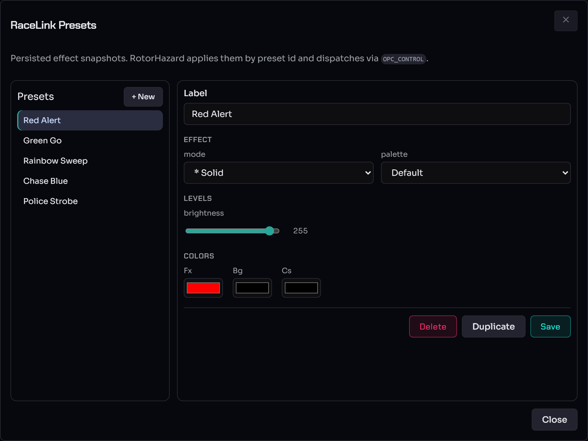

# RL Presets

RaceLink presets ("RL presets") are host-stored, named snapshots of
effect parameters. A scene action can apply one by name instead of
inlining a dozen parameters into every action, and RotorHazard can
apply one by id. This page covers the RL Presets library; for using a
preset inside a scene see [Scene authoring](scene-authoring.md).

> **Audience.** Operators building the reusable effect library their
> scenes draw on.

> **RL Presets vs WLED Presets.** RL presets are RaceLink-native and
> referenced by name; WLED presets are WLED's own per-device slots,
> addressed by index, and managed in the [WLED Presets
> dialog](firmware-updates.md#wled-presets). Both terms are defined in
> the [Glossary §"Preset"](../glossary.md#preset).

---

## The RL Presets dialog

Open it from the **RL Presets** button on the Devices-page menu band,
or **Manage RL Presets** on the Scenes page.

The dialog is split into two panes:

* **Left — the library.** Every saved RL preset, plus **+ New**. Each
  row is a named snapshot (e.g. *Red Alert*, *Green Go*, *Rainbow
  Sweep*).
* **Right — the editor** for the selected preset:
    * **Label** — the preset name (referenced from scene actions).
    * **Effect** — **mode** (the effect kind, e.g. `* Solid`) and
      **palette**.
    * **Levels** — **brightness** (0–255).
    * **Colors** — **Fx** (foreground/effect), **Bg** (background), and
      **Cs** (custom/secondary) colour pickers.
    * **Delete**, **Duplicate**, **Save**.

The fields adapt to the effect mode — solid colours expose colour
pickers; palette effects expose a palette and speed; pattern effects
expose per-segment parameters.

---

## Create and edit a preset

1. Click **+ New**, give it a **Label**.
2. Pick the **mode** and **palette**, set **brightness**, and choose
   the **Fx / Bg / Cs** colours.
3. Click **Save**.

**Duplicate** clones the selected preset as a starting point;
**Delete** removes it (confirm-gated). The editor warns on unsaved
changes via the same byte-exact dirty check the scene editor uses — if
the prompt fires after a save, you've changed something since.

---

## How presets are referenced

RL presets are referenced **by name** from scene actions
(`apply_rl_preset:<name>`). **Renaming a preset re-points every scene
action that uses it automatically** — the host re-writes scene records
when the preset record changes, so you never chase stale references.

RotorHazard applies presets **by id** and dispatches them via
`OPC_CONTROL` (as the dialog's subtitle notes). For the wire-level
mapping of an RL preset to `OPC_CONTROL` see
[opcodes.md](../reference/opcodes.md).

The cost-estimator badge in the scene editor shows roughly how many
bytes each application costs — your guide if you need to fit a
multi-action scene under tight LoRa airtime.

---

## See also

* [Scene authoring](scene-authoring.md) — composing scenes that apply
  these presets, the target picker, offset mode, and the run flow.
* [Discover & configure devices](device-setup.md) — apply a preset to
  a single device directly from its Device Options dialog.
* [Opcodes](../reference/opcodes.md) — `OPC_CONTROL` and how a preset
  maps to the wire.
* [Glossary §"Preset"](../glossary.md#preset).
