# Scene authoring

Once your devices are discovered, grouped, and any per-device Specials
are configured, this guide walks the scene-editor side: composing
scenes, the action kinds, the target picker, offset mode, the run flow,
and scope on multi-network setups.

> **Audience.** Operators who already have devices on the wire (see
> [Discover & configure devices](device-setup.md)) and now want to
> author the effects they fire during a race.

The reusable effect library a scene draws on lives in [RL
Presets](rl-presets.md). For the on-disk shape of `scenes.json` see
[scene-format.md](../reference/scene-format.md); for the on-screen map
of the WebUI see the [WebUI Overview](webui-overview.md).

---

## The Scenes page

Open the **Scenes** page from the menu band.

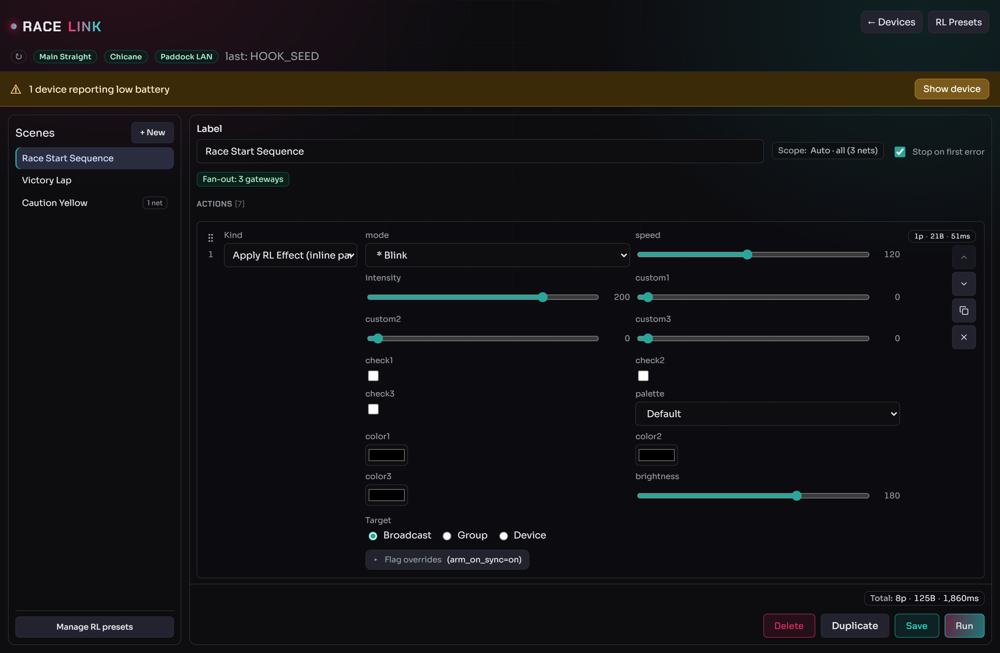

The left sidebar is the scene library; the right pane is the editor for
the selected scene (label, scope chip, **Stop on first error** toggle,
the action list, and the sticky footer with the cost total and the run
controls).

### The scene library

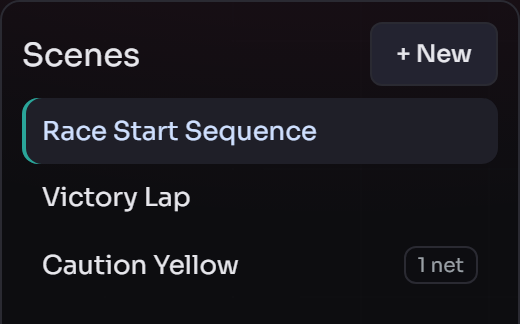

Each row is a saved scene. A small badge (e.g. **1 net**) flags a scene
pinned to a single network via [Explicit
scope](#scene-scope-on-multi-network-setups). The menu band carries
**+ New**, **Duplicate**, **Delete**, and **Manage RL Presets**.

---

## Author a scene

Click **+ New** to start a draft.

* Set the **Label** (free-form text).
* Click **Add action** at the bottom of the list to append an action.
* Each action picks a **kind** and configures its target and
  parameters via the [unified target
  picker](#the-target-picker-broadcast--groups--device).
* The cost badge under each action shows packets / bytes / airtime;
  the scene-total badge in the footer shows the sum.
* Click **Save** (or **Create** for a new scene). Drafts survive page
  reloads as long as you don't close the tab — but the unsaved-changes
  warning fires on refresh / close / nav-away if you have edits.

### Reordering, inserting, and duplicating actions

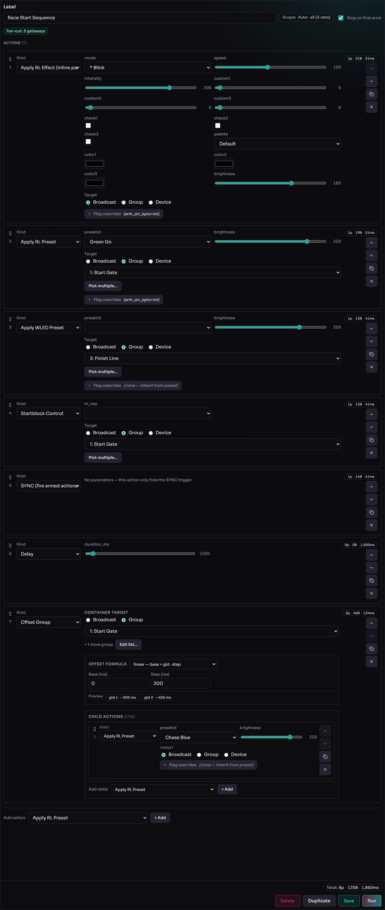

* **Drag to reorder.** Each action row carries a drag handle (the
  dotted grip on the left). Drag a row up or down to reorder; the
  up/down chevrons on the right do the same one step at a time.
* **Insert in the middle.** Hover the gap between two rows to reveal a
  thin **+ Insert action** chip — clicking it opens a compact kind
  picker right there, so you don't have to append at the bottom and
  drag the new row up. The bottom **Add action** button remains for
  appending at the end and is the only entry point on an empty scene.
* **Duplicate.** The duplicate icon on any row clones it directly below
  the original — handy for repeating a preset with a different target.

The same drag-reorder, hover-insert, and Duplicate pattern works for
the child actions inside an `Offset Group` container.

### The sticky footer

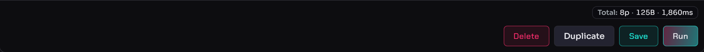

The footer pins the scene-total cost badge (`Total: 8p · 125B ·
1,860ms`) and the **Delete / Duplicate / Save / Run** buttons so
they're always reachable on a long scene.

---

## Action kinds

A scene action is one of these kinds. The header badge on each row
shows that action's estimated cost (`packets · bytes · airtime`).

### Apply RL Effect (inline parameters)

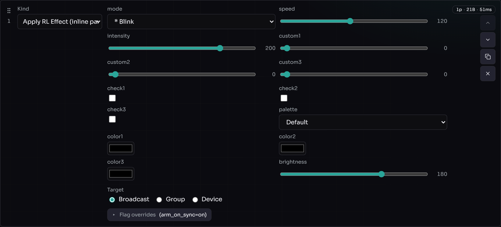

Dispatches an effect with its parameters inlined directly into the
action (`OPC_CONTROL`): **mode**, **speed**, **intensity**,
**custom1–3**, **check1–3**, **palette**, **color1–3**, and
**brightness**. Use this for a one-off effect; for a reusable named
snapshot, prefer [Apply RL Preset](#apply-rl-preset).

### Apply RL Preset

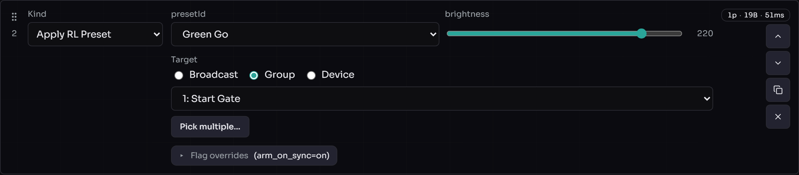

Applies a saved [RL preset](rl-presets.md) by name (`presetId`), with a
brightness override and the target picker. The **Flag overrides** row
(e.g. `arm_on_sync=on`) controls whether the action arms on the device
and fires on the next [SYNC](#sync) instead of immediately.

### Apply WLED Preset

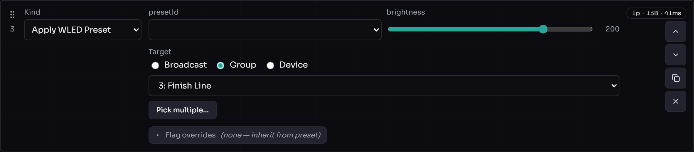

Applies a WLED per-device preset slot by index (`OPC_PRESET`). Manage
the underlying slots via the [WLED Presets
dialog](firmware-updates.md#wled-presets).

### Startblock Control

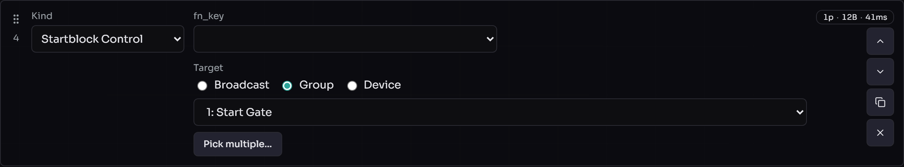

Sends a starting-block function (`fn_key`) to the targeted
starting-block group(s).

### SYNC

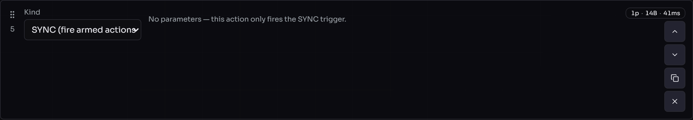

Fires the SYNC trigger so every previously armed (`arm_on_sync`) action
materialises at once. No parameters, no target — it's a broadcast tick.

### Delay

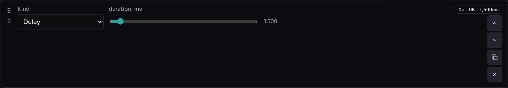

Pauses the runner for `duration_ms` before the next action. Costs no
packets (`0p · 0B`) but adds wall-clock time — see [the cost-badge
pitfall](#common-scene-editor-pitfalls).

### Offset Group

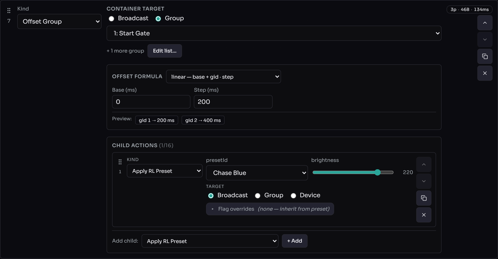

The container action: pick which groups participate (the **container
target**, Broadcast or Groups — Device is hidden here), choose the
**offset formula** that turns each group's id into a per-device delay,
and drop **child actions** inside. The preview chips
(`gid 1 → 200 ms`, `gid 2 → 400 ms`) show the resolved offsets live.
Children typically carry `arm_on_sync` so they queue on the device and
fire offset-shifted on the next SYNC. Full behaviour in [Working with
offset mode](#working-with-offset-mode).

---

## The target picker: Broadcast / Groups / Device { #the-target-picker-broadcast--groups--device }

Every action that targets devices uses the same picker — three radios
with the matching value picker below:

* **Broadcast** — every device on the wire receives the packet. No
  value picker; one packet hits the whole fleet (`recv3=FFFFFF`,
  `groupId=255`). The cheapest wire path; pick this when the effect is
  for everyone.
* **Groups** — pick one or more groups via a search dialog. Length-1 is
  the common case; longer lists fan out one packet per group. The
  action body shows a compact `N groups · M devices` summary plus an
  **Edit groups…** / **Pick multiple…** button. Inside the dialog a
  **search field** filters live and three batch buttons (**Select all
  hits**, **Deselect all hits**, **Invert hits**) act on the visible
  hits. **Apply** writes the selection; the footer warns if you've
  selected *every* known group — the host's save-time canonicaliser
  then rewrites the target to **Broadcast** so the runtime and the cost
  badge agree. To keep a *frozen* subset (one that won't auto-include a
  group added later), un-check at least one group.
* **Device** — pick one device from a MAC dropdown. The host sends with
  the device's stored `groupId`, surfacing any drift between the host's
  repository and the device's actual state (see the [Single-device
  pinned rule](../reference/broadcast-ruleset.md#single-device-pinned-rule)).

The picker hides **Device** at the **Offset Group** container level —
the offset formula is per-group, so a single-device container target is
invalid. Children inside an Offset Group get the full picker again, with
**Groups** filtered to the parent's participating set.

The cost badge below each action shows packets / bytes / airtime. For
Offset Group containers it also reports the optimizer's chosen wire path
(Strategy A / B / C) so you can see whether the broadcast formula or
per-group fan-out won.

---

## Working with offset mode { #working-with-offset-mode }

The **Offset Group** action is the right tool when you want different
groups to start the same effect at different moments (a "wave" or
"cascade" along a row of gates). The container has three parts:

* **Participants** (target picker, Broadcast / Groups): which groups
  receive the offset.
* **Mode**: the formula that turns each device's groupId into a delay
  in milliseconds. Five options:
    * **`linear`** — `offset = base + groupId × step`. A straight
      cascade.
    * **`vshape`** — `offset = base + |groupId − center| × step`. A V
      around `center`.
    * **`modulo`** — `offset = base + (groupId % cycle) × step`.
      Repeating cycle.
    * **`explicit`** — give each group its own `offset_ms`. Most
      flexible.
    * **`none`** — clear any previously-configured offset. The
      "deactivate offset mode" workflow.
* **Children**: actions to dispatch with the offset applied. Children
  typically have `arm_on_sync` enabled; they queue on the device, then
  fire all at once (offset-shifted) when the next `Sync` action runs.

### Important: offset mode is sticky

Once a device has executed an `Offset Group` action with a non-`none`
mode, it is **in offset mode** until you explicitly take it out. The
firmware enforces this strictly:

* Normal (non-`offset_group`) actions are **silently dropped** on
  devices in offset mode. The master bar shows TX activity but the
  devices don't react.
* `Offset Group` actions with a non-`none` mode reach those devices
  (and reach exactly them — the broadcast targeting optimisation
  depends on this).
* Only an `Offset Group` action with `mode=none` transitions the device
  out of offset mode.

This is by design: switching between "in offset mode" and "not" is an
explicit operator action, not a side-effect of regular dispatch.

### Clearing offset mode

An `Offset Group` action with `mode=none` and at least one child does
**two things in one scene**:

1. Sends `OPC_OFFSET(NONE)` to the participants (sets
   `pendingChange.mode = NONE`).
2. Sends each child with the `OFFSET_MODE` flag set to `0`. The strict
   gate accepts these, and on materialisation the active state
   transitions to `NONE` too.

After this action runs, the participants accept normal packets again.

**You cannot clear offset mode with a normal action.** If your scene has
a plain `Apply WLED Preset` after an `Offset Group(linear)`, the preset
is silently dropped on the offset-configured devices. Insert an
`Offset Group(mode=none, children=[…])` before the preset.

**Pure clear without an effect**: use `mode=none` with a placeholder
child (e.g. `rl_effect` with `mode=0`, `brightness=0`). The
`OPC_OFFSET(NONE)` packet clears; the placeholder child carries `F=0`
to materialise the transition.

**Sticky offset on children**: a child action's `offset_mode` flag is
decided by the parent's `mode`, not by per-child `flags_override`.
Setting `offset_mode=False` in a child override is a no-op.

### Operator workflow rule of thumb

Run scenes in this order when mixing offset and normal effects:

1. `Offset Group(mode=linear/etc.)` — set up offset, queue effects,
   fire SYNC.
2. (Optional) more `Offset Group` scenes — change the formula or queued
   effect; offset mode stays.
3. `Offset Group(mode=none, children=[…])` — exit offset mode.
4. Normal scenes — work as expected on the now-cleared devices.

If a normal scene "doesn't do anything" but the master bar shows TX
activity, the targets are probably still in offset mode. Run an
`Offset Group(mode=none)` first.

---

## Run a scene { #run-a-scene }

With a saved scene selected in the sidebar, click **Run**. The relevant
gateway badge goes to **TX**; the action rows border-colour green (ok),
red (error), or amber (degraded) as the run progresses. The summary
lands in the **Last run** status line. The Run button (and Save /
Duplicate / Delete) disable for the duration so you can't queue a
duplicate by mis-clicking.

### "Stop on error" (default ON)

Each scene carries a **Stop on first error** checkbox in its header,
default checked:

* **Checked (default)**: the runner aborts the moment any action fails.
  Remaining actions are marked **skipped** (greyed pips) and the status
  line reads e.g. *"aborted at action #3 (tx_rejected: txPending).
  Remaining actions skipped — uncheck 'Stop on error' to play
  through."* A half-failed sequence usually leaves the network in a
  state that doesn't match operator intent, so further sends waste
  air-time.
* **Unchecked**: every action runs regardless of earlier failures.
  Useful when each action is independent (e.g. a snapshot dump).

A `degraded` outcome (e.g. an action targets a device the host doesn't
know) does **not** trigger the abort — only outright `ok=False`
terminates.

### Scene scope on multi-network setups { #scene-scope-on-multi-network-setups }

When you have multiple gateways attached, every scene carries a
**Scope** chip in the editor header (next to "Stop on first error").
Click it to choose between **Auto** and **Explicit**:

* **Auto** (default) — the host computes the scope from the scene's
  action targets at runtime. The chip shows what Auto currently
  resolves to (e.g. *"Auto · TrackA + TrackB"*) and updates live as you
  edit.
* **Explicit** — pin the scope to a specific set of networks. Per-action
  target pickers then filter their group/device dropdowns to in-scope
  networks only.

**When to use Explicit:** a "fleet trigger" scene that should only fire
on one race's network; a `broadcast`-target action you want scoped to a
subset of networks; or anti-mistake pinning so a future edit can't
silently widen the scope.

**Out-of-scope actions.** Switching to a smaller Explicit scope flags
existing rows that now target out-of-scope devices with an *"out of
scope"* warning chip and a red border; Save attempts but the server
returns HTTP 400 with the offending row highlighted.

**Deleted network in an Explicit scope.** The sidebar shows an amber dot
next to the scene; opening it surfaces the stale id with a remove-X. The
runtime soft-filters the missing id; if all ids were stale, broadcasts
are recorded as degraded (`error="scope_resolved_empty"`) rather than
silently widening back to "every gateway".

**Fan-out indicator.** When a scene's broadcasts will hit 2+ gateways, a
green *"Fan-out: N gateways"* pill appears under the header (hover for
the names). LoRa airtime stays the same as a single-network broadcast —
workers run in parallel.

For the wire-format details + degradation rules table see
[multi-network.md §"Scene broadcast scope"](multi-network.md#scene-broadcast-scope).

### Measured run-time alongside estimates { #measured-run-time-alongside-estimates }

After a successful run, the cost badges extend with an "actual: NNN ms"
fragment:

```
≈ 3 pkts · 84 B · 12 ms · actual: 47 ms
```

The "≈ X ms" is the *estimated LoRa airtime* (Semtech AN1200.13). The
"actual: NNN ms" is the *measured wall-clock duration* of that action
on the most recent run (USB latency, gateway LBT backoff, host-side
overhead). A hover tooltip shows the breakdown:

```
Last run: 47 ms wall-clock (estimate 12 ms · +35 ms overhead).
```

The actual values stick until you load a different scene, create a new
draft, or run the same scene again. Edits don't invalidate them — the
estimate side updates live, but "actual" keeps the last run's data so
you can compare before/after tweaks.

---

## Common scene-editor pitfalls { #common-scene-editor-pitfalls }

### "Run reports OK but nothing happens"

* The action targeted a group with no capable devices. The editor's cap
  filter prevents this in new scenes, but old scenes may predate it —
  re-edit and the dropdown tells you which groups have the capability.
* The target devices are offline. The runner doesn't know that — refresh
  the device table (**Get Status**) to see who's reachable.
* The target devices are still **in offset mode** from a previous
  `Offset Group(linear/etc.)` and the current action is normal. Insert
  an `Offset Group(mode=none, children=[…])` — see [Clearing offset
  mode](#clearing-offset-mode).

### "Scene editor says I have unsaved changes but I just saved"

A successful save resets the unsaved-changes flag. If the prompt fires
anyway, you've changed something since (added a character, dragged an
action, …). The dirty check is byte-exact on the canonical scene shape;
even whitespace in the label counts.

### "The cost badge says ≈ 50 ms airtime but my scene takes 5 seconds"

The cost badge shows *radio airtime*. Delays (`Delay` action) and
host-side inter-action gaps aren't included. Delays + airtime is roughly
your end-to-end run time.

---

## Limits

* **Actions per scene**: 20 (configurable in `scenes_service.py`).
* **Children per offset_group**: 16.
* **Brightness**: 0–255.
* **Effect parameters**: 0–255 each.
* **Group ids**: 1–254 (0 is Unconfigured, 255 is broadcast).
* **Preset ids**: 0–255.

For gateway / OTA / network-level limits see [Firmware
updates](firmware-updates.md) and [Multi-Network](multi-network.md).

---

## See also

* [RL Presets](rl-presets.md) — the named effect library scenes apply.
* [WebUI Overview](webui-overview.md) — the on-screen map.
* [Multi-Network operator guide](multi-network.md) — scene broadcast
  scope at the wire level.
* [Opcodes](../reference/opcodes.md) — `OPC_CONTROL` / `OPC_OFFSET` /
  `OPC_SYNC`.
* [Scene file format](../reference/scene-format.md) — `scenes.json` on
  disk.
