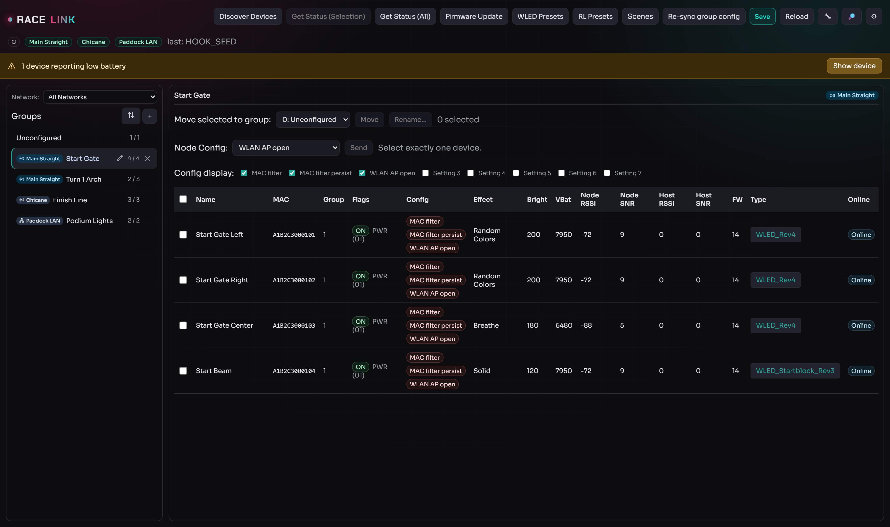
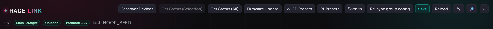
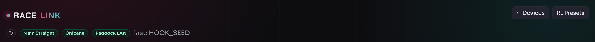
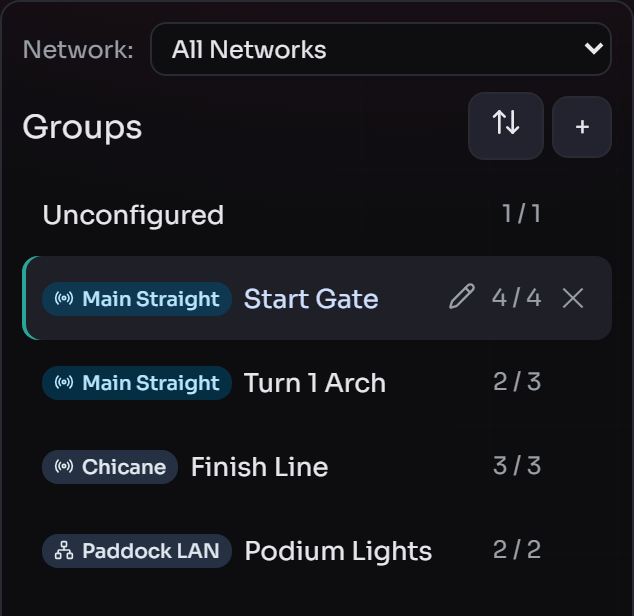
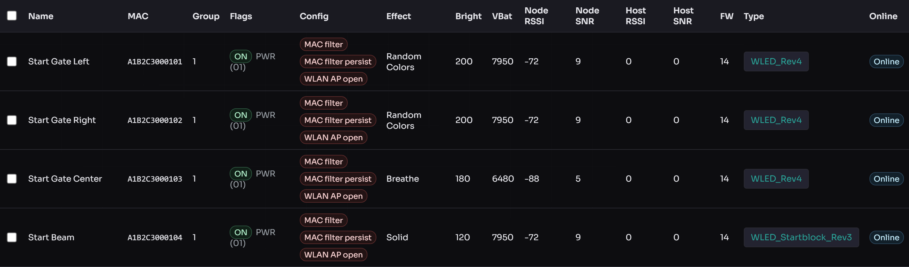
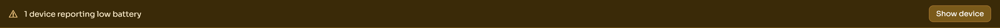
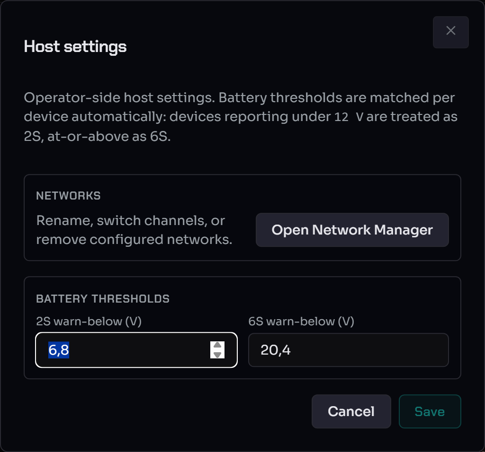

# WebUI Overview

Your map of the RaceLink Host WebUI: what each page, bar, badge and
dialog is showing, and where to go next for each workflow. Read this
first — the task-shaped guides ([Discover & configure
devices](device-setup.md), [Firmware updates & WLED
presets](firmware-updates.md), [RL Presets](rl-presets.md), [Scene
authoring](scene-authoring.md), [Multi-Network](multi-network.md))
drill into the individual flows.

> **Audience.** Operators who want orientation before they start, and
> developers looking up which on-screen element maps to which
> protocol concept.

The host WebUI is mounted at `/racelink` in both hosting modes:

* **Standalone:** `http://127.0.0.1:5077/racelink/`
* **RotorHazard plugin:** `http://<rotorhazard-host>:5000/racelink/`

In both modes the same HTML, JS and CSS are served — the host owns the
WebUI assets, the plugin only mounts them.

---

## The two pages

The WebUI has two top-level pages plus a family of dialog modals:

| Page | URL | Purpose |
|---|---|---|
| **Devices** | `/racelink/` | Device discovery, group management, device specials, RL preset library, firmware updates |
| **Scenes** | `/racelink/scenes` | Scene authoring, scene library, scene runner |
| **(dialogs)** | modal overlays | Discover, Network Manager, Channel Scan, Pair Assistant, Host Settings, Firmware Update, WLED / RL Presets, Specials, … |

The menu band at the top links between Devices and Scenes; the active
page's link is highlighted.

### The Devices page at a glance



Four bands stack top to bottom:

1. The **menu band (ribbon)** with the page actions and the
   header icon buttons.
2. The **master bar** with one badge per attached gateway.
3. The **group sidebar** on the left (network filter + groups).
4. The **device table** on the right (one row per device).

The Scenes page reuses the same menu band + master bar and swaps the
sidebar/table for the scene list and editor — see [Scene
authoring](scene-authoring.md).

---

## The menu band (ribbon)



On the **Devices** page the band groups the top-level actions:

* **Discover** — find new devices on the wire → [Discover &
  configure devices §Discover](device-setup.md#discover-devices).
* **Get Status** — poll every device for its current state. On a
  multi-gateway setup every gateway is polled in parallel, so the
  refresh takes about as long as a single gateway's poll.
* **Re-sync group config** — re-broadcast every device's stored group
  assignment to the network; the recovery action after nodes were
  reflashed or moved → [§Re-sync group config](device-setup.md#re-sync-group-config).
* **RL Presets** — open the [RL Presets](rl-presets.md) library.
* **WLED Presets** — push a `presets.json` to devices → [Firmware
  updates & WLED presets](firmware-updates.md#wled-presets).



On the **Scenes** page the band carries the scene-library actions
(**+ New**, **Duplicate**, **Delete**, **Manage RL Presets**) — see
[Scene authoring](scene-authoring.md).

### The header icon buttons

To the right of the band, three icon buttons open the
setup-and-maintenance dialogs:

* **Wrench → Pair Assistant** — recover devices that won't auto-pair
  after a gateway change → [Multi-Network
  §Setup-Change Assistant](multi-network.md#setup-change-assistant).
* **Magnifier → Channel Scan** — find devices stranded on another
  channel → [Multi-Network §Channel Scan](multi-network.md#channel-scan-stranded-device-recovery).
* **Gear → Host Settings** — the [Host Settings dialog](#host-settings)
  below.

---

## The master bar — gateway badges


Each badge represents one **attached gateway**. The colour tracks that
gateway's reported state byte (the host never infers state from
outcome events): green when it is ready (`IDLE`), and a non-green
colour or border when the gateway has a problem — at which point its
**network is effectively unreachable**, because all traffic to that
network flows through the gateway. **Hover any badge** for a tooltip
with the per-gateway status detail (bind state, RF state, ident MAC,
and any conflict fields).

The badge label is the network name plus the last hex digits of the
gateway's ident MAC, so two gateways on the same network stay
distinguishable. The **↻** button next to the badges fans a state
request out to every gateway in parallel and refreshes them in one
round-trip — useful right after a USB reconnect when a badge is still
grey but you want confirmation it's back on the wire.

The full per-badge colour table (bind state × RF state) lives in
[Multi-Network §Per-gateway pills](multi-network.md#per-gateway-pills);
a `⚠ Pair…` button appears in the band whenever any gateway is in
`conflict` or `unbound`.

> On a single-gateway deployment the bar shows exactly one badge.

The bar also carries a small **last-activity** indicator showing the
host's most recent activity, and the SSE-driven banner area (see
[Connection banners](#connection-banners-and-recovery) below).

---

## The group sidebar



The left sidebar lists groups. Each row shows an **`M / N`** count
(devices currently online out of total in the group) and, on
multi-network setups, a coloured **network badge** (RF or Ethernet).
When any device in a group receives data the row briefly flashes — the
same live visual language the table rows use.

Above the list:

* a **Network filter** dropdown — appears only when more than one
  network exists; "All Networks" is the default;
* the **+** button to create a group, and the **↕ Manage groups**
  button beside it.

Creating groups, assigning devices, and moving groups between networks
are covered in [Discover & configure devices §Groups](device-setup.md#create-groups-and-assign-devices)
and [Multi-Network §Move groups between networks](multi-network.md#move-groups-between-networks).

---

## The device table



One row per device. Columns surface the device name, MAC (last 6),
online state, last-seen, brightness, battery, and — on multi-network
setups — a **Network** badge (hover for the last-known `freq_hz` /
SF / BW / SyncWord). Per-row controls:

* the **Specials** button — opens the per-device [Device
  Options dialog](device-setup.md#configure-devices-specials);
* the **Node Config** dropdown — single-shot device commands (forget
  master MAC, reboot node, AP open/closed) → [Device setup
  §Node config](device-setup.md#node-config-single-shot-commands).

Tick rows to select them for the [bulk
actions](device-setup.md#bulk-actions) (move to group, etc.).

### Low-battery banner



When one or more devices report a low battery, a warning banner
appears above the table naming the affected nodes. It clears
automatically once the devices report a healthy level again.

---

## Host Settings



Opened from the **gear** icon in the menu band. Host-wide preferences
live here (and a shortcut into the [Pair
Assistant](multi-network.md#setup-change-assistant) for operator-driven
inspection at any time).

---

## How the UI stays live — the SSE refresh model

The WebUI never polls. All data updates arrive over a single
Server-Sent-Events (SSE) stream, with two event types:

* **`refresh`** — `{"what": [...]}` — the JS reloads parts of its model
  from the REST API. Tokens: `groups`, `devices`, `presets`, `scenes`.
* **`task`** — `{"name", "stage", "message", ...}` — long-running task
  progress (Discover, OTA, Get Status, …).

Each operator action that mutates persisted state passes a scope set to
the host, and the SSE broadcast follows — so a device rename reloads
only the device table, leaving group and preset dropdowns untouched.
For the full mapping see [SSE channels & state
scopes](../reference/sse-channels.md) and [architecture.md §"UI Scope
Matrix"](architecture.md).

### Long-running operations — the task-manager pattern

Operations that take more than a few seconds (Discover, OTA, Get
Status on a big fleet, Presets upload) run through the host's **task
manager**:

1. You click **Start** in a dialog.
2. The dialog stays open, the Start button disables, and progress
   streams in via SSE `task` events.
3. **Closing the dialog does not cancel the work** — the task runs in a
   host-side thread independent of the WebUI.
4. On completion the dialog shows per-device results.

---

## UI conventions

These are enforced across every page:

* **Confirmation.** Destructive actions confirm with a
  *"{Verb} {subject}? {Consequence}."* prompt (e.g. *"Delete scene
  'Intro Effects'? This cannot be undone."*).
* **Toasts.** Green toast (≈3 s) for success/info ("Saved", "Run
  completed"); red toast (≈5 s) for validation/server errors. Native
  `alert()` is never used.
* **Busy state.** Long operations disable their initiator button (and
  for gateway-level operations, the whole top bar) until they finish.
* **Unsaved-changes protection.** The Scene and RL Preset editors warn
  on refresh / tab-close / nav-away if you have unsaved edits. The
  dirty check is byte-exact on the canonical record — even whitespace
  in a label counts.

### Cost-estimator badges

Scene actions carry a cost badge, e.g.:

```
≈ 3 pkts · 84 B · 12 ms · actual: 47 ms
```

| Token | Meaning |
|---|---|
| `≈ 3 pkts` | Estimated packet count |
| `84 B` | Estimated total body bytes |
| `12 ms` | Estimated LoRa airtime (Semtech AN1200.13) |
| `actual: 47 ms` | Wall-clock duration of the most recent run |

The estimate is *radio time*; the actual is *wall clock* (includes USB
latency, gateway LBT backoff, host runner overhead). See [Scene
authoring §Measured run-time](scene-authoring.md#measured-run-time-alongside-estimates).

---

## Connection banners and recovery

The WebUI is built to survive RotorHazard restarts and gateway
disconnects without operator intervention. Two banner tiers appear
below the header:

* **Transient banner** (yellow, no Retry button) — auto-clears when
  its condition resolves. Used for "RotorHazard not reachable —
  retrying …", "RotorHazard starting …", and "Gateway port busy,
  retrying in N s". Backoff is exponential and resets on success.
* **Persistent banner** (red, with a **Retry connection** button) —
  used for "RaceLink plugin not loaded" (config error, no auto-retry),
  "No RaceLink gateway found" (`NOT_FOUND`, hardware absent, no
  auto-retry), and "Gateway link lost — retrying in N s" (`LINK_LOST`,
  auto-retry with a countdown plus a manual button).

When a gateway recovers to `IDLE`, a green **"Connection
re-established"** toast appears, the banner dismisses, and the badge
returns to green. On multi-network setups a per-network reconnect
banner lists each missing gateway with its own countdown — see
[Multi-Network §Per-network reconnect banner](multi-network.md#per-network-reconnect-banner).

---

## A healthy-start workflow

Run this top-to-bottom the first time you open the WebUI for a session:

1. **Check the gateway badges (top of the master bar).** Are they all
   green? Hover any that aren't for the reason.
    * A red/amber border (`conflict` / `unbound`) → click **⚠ Pair…**
      or the **wrench** and resolve in the [Pair
      Assistant](multi-network.md#setup-change-assistant).
    * A missing badge with a reconnect banner → plug the gateway back
      in; the host re-attaches it automatically.
2. **Discover devices** if the table is empty → [Discover &
   configure devices](device-setup.md).
3. **Group the devices** and resolve any **Specials** divergence →
   [§Configure devices](device-setup.md#configure-devices-specials).
4. **A device is missing entirely?** It may be stranded on another
   channel — run a [Channel
   Scan](multi-network.md#channel-scan-stranded-device-recovery).
5. **Author your effects** → [RL Presets](rl-presets.md) and [Scene
   authoring](scene-authoring.md), then **Run** from the Scenes page.

If any UI signal misbehaves, see [Troubleshooting](../troubleshooting.md).

---

## See also

* [Discover & configure devices](device-setup.md) — Discover →
  Group → Specials, plus the table toolbars and Node Config.
* [Firmware updates & WLED presets](firmware-updates.md) — OTA flow,
  timing, failure modes, and the WLED Presets uploader.
* [RL Presets](rl-presets.md) — the host-native preset library.
* [Scene authoring](scene-authoring.md) — action kinds, target
  picker, offset mode, run flow.
* [Multi-Network operator guide](multi-network.md) — gateways,
  networks, bind wizard, Network Manager, Channel Scan, Pair Assistant.
* [Opcodes](../reference/opcodes.md) — `OPC_CONTROL` / `OPC_OFFSET` /
  `OPC_SYNC` explained.
* [UI conventions](ui-conventions.md) — button vocabulary and
  toast/confirm conventions (developer-side).
* [RotorHazard plugin (operator)](../RaceLink_RH_Plugin/operator-setup.md) —
  how the WebUI fits inside RotorHazard.
